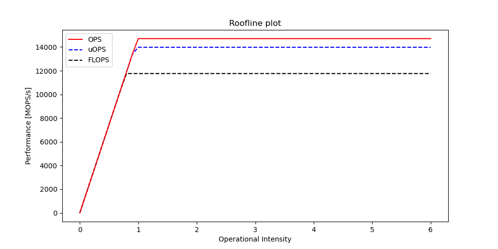
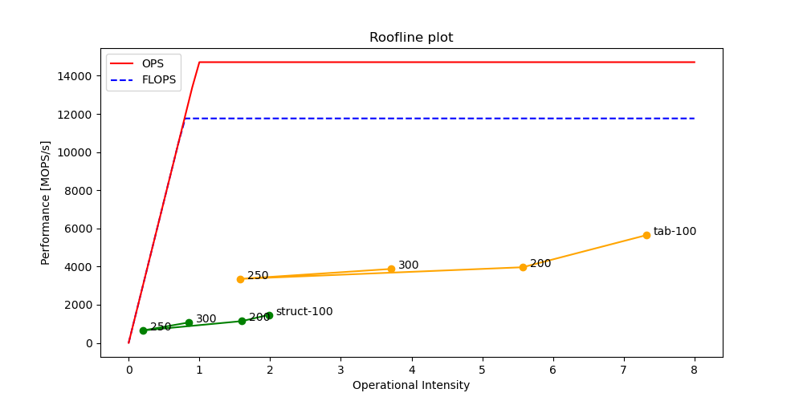
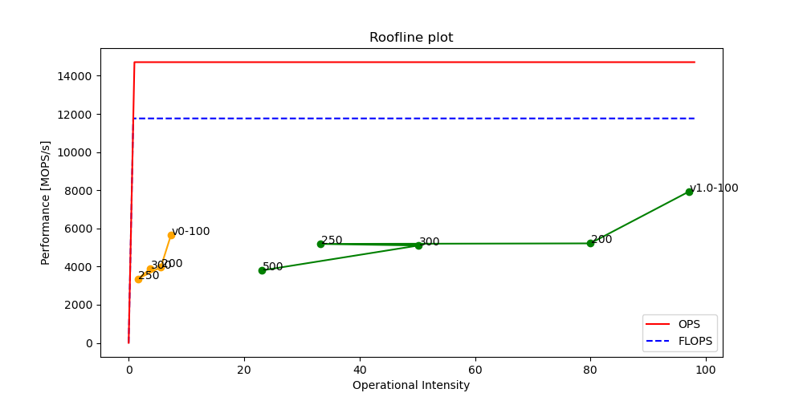
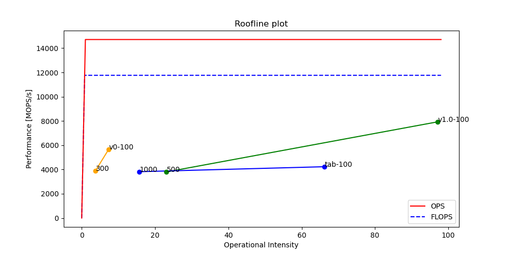
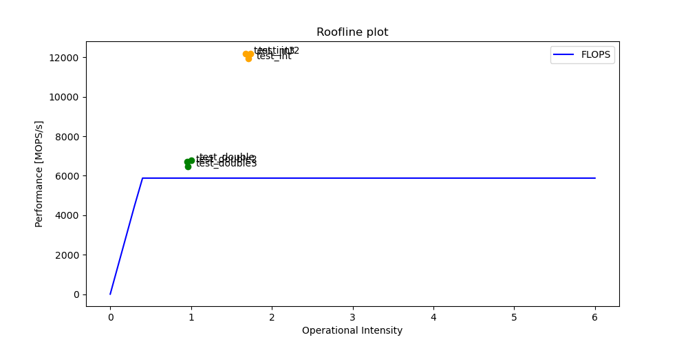
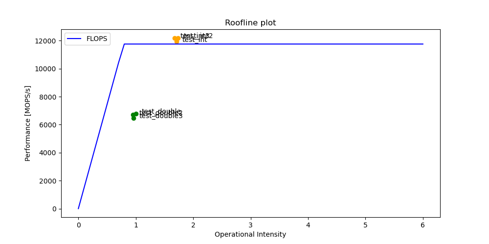
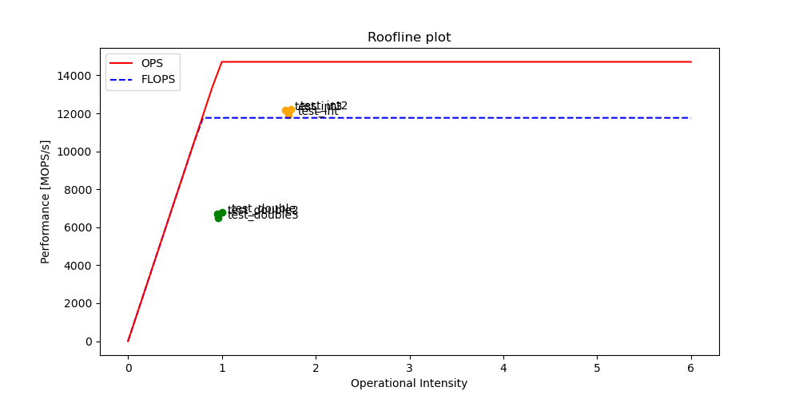

# Roofline model
Pour construire le modèle de roofline, j'ai utilisé le script `compute_roofline` qui va lancer le microbenchmark de likwid avec les tests de _peakflops_ et _load_ pour définir les performances de l'ordinateur et faire une moyenne sur 5 tests. Vu que le processeur _Broadwell_ possède 4 ports permettant d'effectuer des opérations sur des entiers, et 2 sur les nombres à virgule flottante, j'ai multiplié la valeur de _peakflops_ par 2 pour avoir une estimation plus précise (c.f. [Roofline et ILP](#roofline-et-ilp)). Les valeurs de test sont 32KB pour le test _peakflops_ et 10MB pour le test _load_.

La commande utilisée pour lancer le script est la suivante :

```bash
./compute_roofline -c 32KB -m 1GB -f LAPTOP
```

Le modèle présente également les courbes liées aux uOPS et aux OPS totales pour plus de précision (c.f. [Différents types d'opérations](#différents-types-dopérations)).



# Profiling du code
Comme mon architecture de processeur ne proposait pas de groupe de performances qui donnait l'intensité opérationelle directement, j'ai du en créer un et le rajouter dans le dossier correspondant. Je calcule l'intensité opérationelle en divisant le nombre d'opérations effectuées par le nombre de lectures en mémoire fois la taille d'une ligne de cache (64B). Pour avoir une estimation plus précise, j'ai également ajouté les courbes liées aux uOPS et aux OPS totales pour plus de précision ([HPC.txt](#groupe-de-performances-hpctxt)).

La baseline a été effectuée en monitorant tout l'algorithme A* avec les deux type de données (_tab_ et _struct_) et avec des tailles de grille entre 100 et 300 de côté.



Comme on peut voir l'algorithme n'est pas performant du tout, et il prend beaucoup trop de temps pour trouver un chemin. La prochaine étape sera d'identifier les parties critiques du code et de les optimiser.

# Optimisation du code
Comme j'ai passé beaucoup de temps à comprendre comment fonctionnait l'outil `likwid`, je n'ai pas pu beaucoup me pencher sur l'optimisation du code. J'ai donc décidé de me concentrer sur la fonction `compute_path_tab` pour l'instant.
## Précalcul du *h_cost*
La première optimisation à été celle ce précalculer le *h_cost* pour chaque case de la grille. En effet, le *h_cost* ne va pas changer au cours de l'algorithme, donc il n'est pas nécessaire de le recalculer à chaque fois. J'ai donc créé un tableau de la taille de la grille qui contient le *h_cost* de chaque case. 



Cette version apporte déjà une amélioration conséquente sur les performances, notamment en matière d'intensité opérationnelle. Cependant, le temps d'exécution est toujours trop long pour trouver un chemin, et les performances sont toujours trop faibles.

## Optimisation des listes ouvertes et fermées
En observant le _Flamegraph_ de l'executable, on se rend compte que beaucoup de temps est perdu dans la fonction `is_in_list`. Cette fonction permet de vérifier si une case est déjà présente dans une liste ouverte ou fermée. Pour cela, elle parcourt la liste et compare chaque case avec la case à vérifier. Cependant, cette fonction est appelée très souvent, et le temps de parcours de la liste est donc très long. Pour résoudre ce problème, j'ai décidé de créer une liste de taille égale à la taille de la grille, et de mettre à jour cette liste à chaque fois qu'une case est ajoutée ou supprimée d'une liste ouverte ou fermée. Ainsi, pour vérifier si une case est présente dans une liste, il suffit de regarder si la case est à `1` dans la liste.


Après avoir effectué cette optimisation, on remarque que le temps d'exécution est beaucoup plus court, mais que les performances sur le graphe ne sont pas forcément plus élevées. Il y a donc encore pas mal de choses à optimiser.



\pagebreak
# Problèmes rencontrés
## Version de likwid
La version de likwid disponible sur `apt` ne supportait pas les performances pour le processeur _Broadwell_, il fallait donc compiler la dernière version de likwid pour pouvoir utiliser les performances de l'architecture.

## Roofline et ILP
Les premiers tests effectués avec le code d'exemple (calculs sur boucles) on montré des incohérences au niveau des performances. En effet, le modèle de roofline indiquait que le code était plus performant que le processeur, ce qui n'est pas possible. Le modèle de roofline est basé sur le principe de l'ILP (Instruction Level Parallelism) qui permet d'effectuer plusieurs opérations en même temps. En effet, le processeur _Broadwell_ possède 2 ports permettant d'effectuer des opérations sur les nombres à virgule flottante et sur les entiers, et 2 ports supplémentaire effectuant des opérations uniquement sur les entiers. Cependant, le modèle de roofline ne prend pas en compte ce principe, et ne prend donc pas en compte les 2 opérations supplémentaires effectuées en même temps. Pour avoir une estimation plus précise, il faut donc multiplier la valeur de _peakflops_ par 2 (c.f. [Broadwell Microarchitecture](https://en.wikichip.org/wiki/intel/microarchitectures/broadwell_(client)#Block_Diagram))

{width=85%}

## Différents types d'opérations
Un autre problème rencontré était que les opérations sur les entiers n'étaient pas compris dans les calculs de performances. Dans le _perfgroup_ de `likwid-perfctr` j'avais copié le calcul venant d'une autre architecture (_Skylake_) mais qui ne prenait en compte que les calculs sur les nombres à virgule flottante. Pour corriger ce problème, j'ai ajouté les opérations sur les entiers dans le _perfgroup_ et j'ai également ajouté les courbes liées aux uOPS et aux OPS totales pour plus de précision dans le modèle de roofline. Les _counters_ qui comptent aussi les opérations sur les entiers sont `INST_RETIRED.ANY` et `UOPS_RETIRED.ALL` (c.f. [Perfmon Broadwell](https://perfmon-events.intel.com/broadwell.html)).

Cette problématique n'apparait que lors des calculs uniquement sur les nombres à virgule flottante. C'est pour ça que la multiplication par 2 des performances se fait uniquement à la construction du modèle de roofline, car le test _peakflops_ utilisé ne fait que des calculs sur les nombres à virgule flottante.

{width=50%}\ {width=50%}

### Estimation de la roofline
Comme il n'existe pas un test dans `likwid-benchmark` qui permet de visualiser les performances en termes de "_peakops_", j'ai du extrapoler les performances à partir du test _peakflops_. Pour cela j'ai utilisé la commande suivante :

```bash
sudo likwid-perfctr -C E:N:1:1:1 -g HPC -m likwid-bench -t peakflops -W N:32KB:1
```

Cette commande permet de vérifier que le groupe de performances calcule de la bonne manière les _MFLOPS/s_. Grâce à ça on peut déduire les _MOPS/s_ et _uOPS/s_ maximaux pour ce processeur.

\footnotesize
```txt
---------------------------------------------------------------------------
LIKWID MICRO BENCHMARK
Test: peakflops
---------------------------------------------------------------------------
[...]
MFlops/s:		5913.51
[...]
+------------------------------------------+------------+
|                  Metric                  | HWThread 0 |
+------------------------------------------+------------+
|            Runtime (RDTSC) [s]           |     1.4186 |
|        Operational intensity (ALL)       |    34.1636 |
|       Operational intensity (uOPS)       |    32.4635 |
|       Operational intensity (FLOPS)      |    27.3145 |
|      Operations per second [MOPS/s]      |  7396.3116 |
|      Micro-ops per second [MuOPS/s]      |  7028.2415 |
| Floating point ops per second [MFLOPS/s] |  5913.4964 |
+------------------------------------------+------------+
```
\normalsize

On peut voir ici que les _MFlops/s_ mesurés et les _MFLOPS/s_ calculés sont très proches, ce qui prouve que le groupe de performances fonctionne bien. On va donc prendre les valeurs de _MOPS/s_ et _uOPS/s_ pour construire le modèle de roofline. Ces valeurs sont bel et bien plus élevées que les valeurs de _MFLOPS/s_.

\pagebreak
# Conclusion
Malheuresement la partie optimisation du labo n'a pas beaucoup été avancée car la plupart du temps à été consacré à la résolution des problèmes rencontrés. Cependant, on peut quand même tirer quelques conclusions de ce labo. L'outil `likwid` ainsi que `Flamegraph` sont deux outils très puissants qui nous permettent de visualiser les performances de nos programmes. Cependant, il faut bien comprendre comment ils fonctionnent pour pouvoir les utiliser correctement. Il faut aussi bien comprendre les différentes notions de performances (FLOPS, OPS, uOPS, etc.) pour pouvoir les utiliser correctement. Enfin, il faut bien comprendre les différentes notions de parallélisme (ILP, etc.) pour pouvoir les utiliser correctement. Ce fut très intéressant de pouvoir se pencher sur ces notions, même si ce n'était pas forcément très clair au début. Néammoins, je pense que ces notions sont très importantes pour pouvoir optimiser correctement un programme, et seront donc très utiles dans le futur. Je me pencherais plus sur l'optimisation du code au cours de ces prochaines semaines.

\pagebreak
# Annexes
## Groupe de performances (HPC.txt)
```txt
SHORT Overview of arithmetic and main memory performance

EVENTSET
PMC0     INST_RETIRED_ANY_P
PMC1     UOPS_RETIRED_ALL
PMC2     FP_ARITH_INST_RETIRED_SCALAR_DOUBLE
MBOX0C1  DRAM_READS

METRICS
Runtime (RDTSC) [s]                       time
Operational intensity (ALL)               (PMC0)/((MBOX0C1)*64.0)
Operational intensity (uOPS)              (PMC1)/((MBOX0C1)*64.0)
Operational intensity (FLOPS)             (PMC2)/((MBOX0C1)*64.0)
Operations per second [MOPS/s]            1.E-06*(PMC0)/runtime
Micro-ops per second [MuOPS/s]            1.E-06*(PMC1)/runtime
Floating point ops per second [MFLOPS/s]  1.E-06*(PMC2)/runtime
```