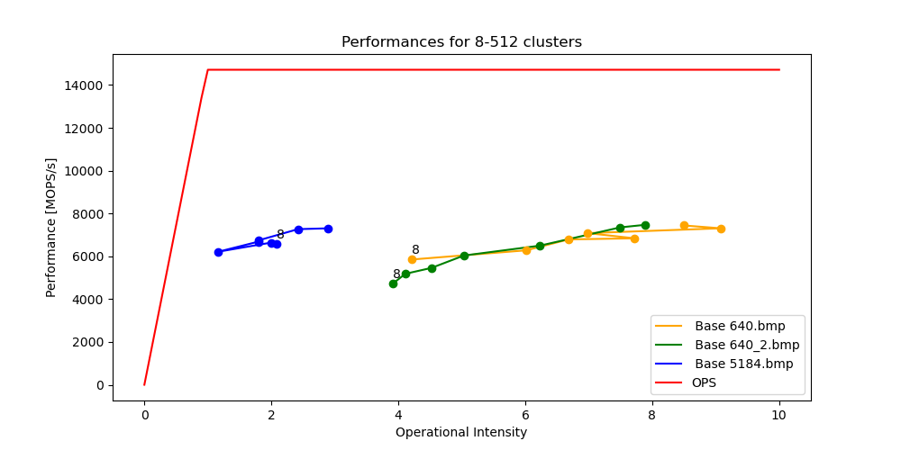

---
title: "Laboratoire 4 : SIMD"
subtitle: "HPC 2023"
author: "Francesco Monti"
date: "9.05.2023"
toc: false
...

# Partie 1
### Compilation avec SIMD
Pour pouvoir compiler les instructions `SIMD` avec `GCC` on doit mettre le flag de compilation correspondant. Dans notre cas, si on veut que GCC utilise les extensions `SSE3` on ajoute :

`CFLAGS= -O3` **`-msse3`** `-std=c11 -Wall -Wextra -pedantic -g -I../include`

au *Makefile*. On peut aussi utiliser les flags `-mavx` et `-mavx2` pour utiliser les extensions `AVX` et `AVX2` respectivement. 

Pour utiliser les extensions `SIMD` dans le code avec les fonctions intrinsèques on doit inclure le fichier `immintrin.h` pour les extensions `SSE` et `AVX`.

### Analyse du code
En regardant une première fois le code on s'aperçoit des nombreuses boucles qui s'exécutent sur des tableaux. Ces boucles sont des cas typiques où on peut utiliser les instructions `SIMD` pour accélérer le code. En effet, les instructions `SIMD` permettent de faire des opérations sur plusieurs données en même temps. Dans notre cas, on peut faire des opérations sur 4 `float` en même temps. On peut donc faire 4 fois moins d'itérations dans les boucles et gagner ainsi des performances. Mais pour cela il faut faire attention à ce que nous tableaux soient alignés correctement sur 128 bits. Si on regarde les performances du code avant optimisation on obtient ces graphiques :




On peut voir que les performances ne sont pas nulles, mais on peut les améliorer.

### Calcul de la distance


### Alignement des tableaux
Pour utiliser efficacement les fonctions `SIMD` on doit s'assurer que les tableaux sont alignés correctement sur 128 bits. Pour ce faire on remplace la fonction `malloc` par la fonction `aligned_alloc` qui permet d'allouer de la mémoire alignée. On doit lui passer l'alignement en paramètres en bytes, dans notre cas _16_. On pourrait également utiliser la fonction `__mm_malloc` mais il faudrait remplacer les appels à `free` par `__mm_free`.

### Code motion
Une première optimisation qui est possible est de chercher et remplacer toutes les occurences d'un calcul immuable par une variable. Dans notre cas on peut voir que dans les fonction `kmeans` et `kmeans_pp` on calcule souvent la taille totale de l'image, soit `width * height`. On peut donc remplacer ces calculs par une variable `total_pixels` qui ne sera calculée qu'une fois. On peut également voir que lors du calcul de distance, on calcule souvent deux fois la distance avant de la mettre au carré. On peut donc calculer la distance une fois et la mettre au carré ensuite. On peut le voir ici :

```c
// image_segmentation/src/k-means.c#L78-L79
```

### Vectorisation
On peut vectoriser une partie du code, spécialement les boucles qui parcourent tous les pixels de l'image. On peut voir dans la fonction `kmeans` quand on calcule le poids de tous les pixels par exemple. On peut le voir par exemple dans la boucle qui calcule les distances entre le premier centre et tous les pixels :

```c
// image_segmentation/src/k-means.c#L37-L52
```

Ici on a remplace l'exécution normale de la boucle par une vectorisation avec des instructions `SSE`. On remplace notamment les 4 multiplications des distances