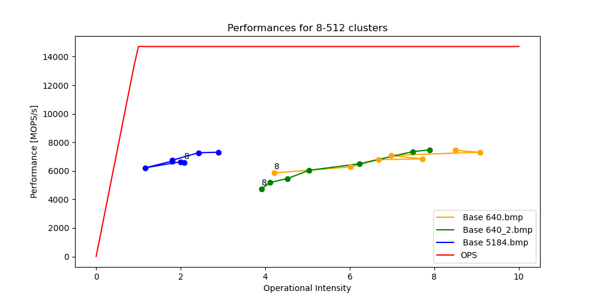
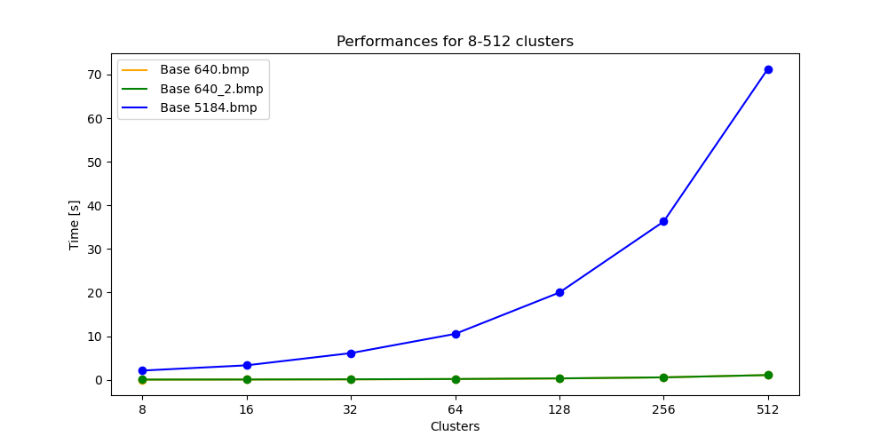
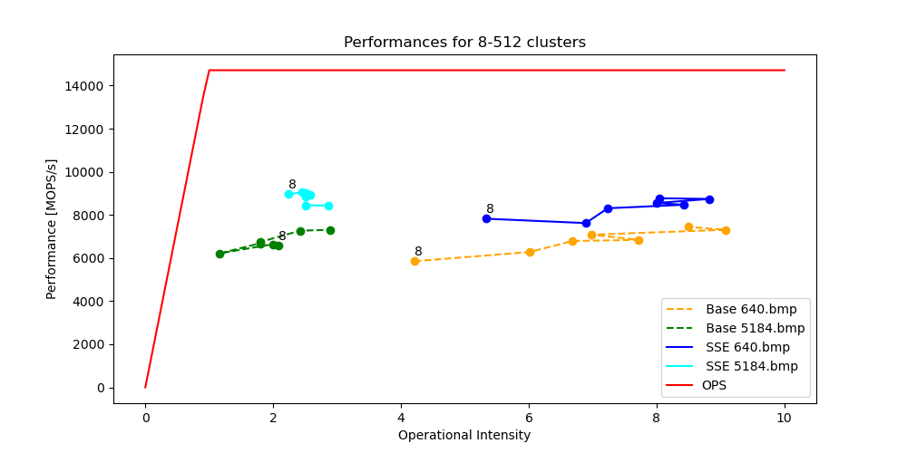
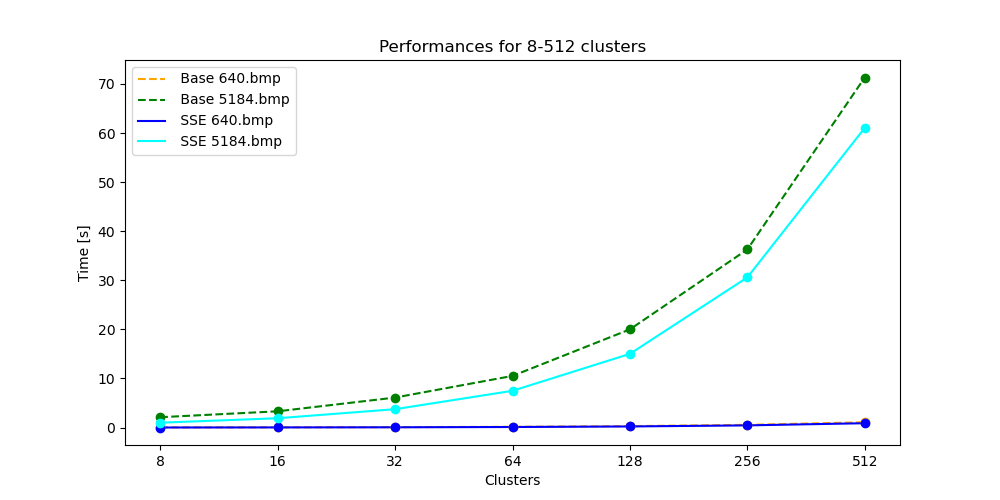

# Partie 1
### Compilation avec SIMD
Pour pouvoir compiler les instructions `SIMD` avec `GCC` on doit mettre le flag de compilation correspondant. Dans notre cas, si on veut que GCC utilise les extensions `SSE3` on ajoute :

`CFLAGS= -O3` **`-msse3`** `-std=c11 -Wall -Wextra -pedantic -g -I../include`

au *Makefile*. On peut aussi utiliser les flags `-mavx` et `-mavx2` pour utiliser les extensions `AVX` et `AVX2` respectivement. 

Pour utiliser les extensions `SIMD` dans le code avec les fonctions intrinsèques on doit inclure le fichier `immintrin.h` pour les extensions `SSE` et `AVX`.

### Analyse du code
En regardant une première fois le code on s'aperçoit des nombreuses boucles qui s'exécutent sur des tableaux. Ces boucles sont des cas typiques où on peut utiliser les instructions `SIMD` pour accélérer le code. En effet, les instructions `SIMD` permettent de faire des opérations sur plusieurs données en même temps. Dans notre cas, on peut faire des opérations sur 4 `float` en même temps. On peut donc faire 4 fois moins d'itérations dans les boucles et gagner ainsi des performances. Mais pour cela il faut faire attention à ce que nous tableaux soient alignés correctement sur 128 bits. Si on regarde les performances du code avant optimisation on obtient ces graphiques :




On peut voir que les performances ne sont pas nulles, mais on peut les améliorer.

### Alignement des tableaux
Pour utiliser efficacement les fonctions `SIMD` on doit s'assurer que les tableaux sont alignés correctement sur 128 bits. Pour ce faire on remplace la fonction `malloc` par la fonction `aligned_alloc` qui permet d'allouer de la mémoire alignée. On doit lui passer l'alignement en paramètres en bytes, dans notre cas _16_. On pourrait également utiliser la fonction `__mm_malloc` mais il faudrait remplacer les appels à `free` par `__mm_free`.

### Code Motion
Une première optimisation qui est possible est de chercher et remplacer toutes les occurences d'un calcul immuable par une variable. Dans notre cas on peut voir que dans les fonction `kmeans` et `kmeans_pp` on calcule souvent la taille totale de l'image, soit `width * height`. On peut donc remplacer ces calculs par une variable `total_pixels` qui ne sera calculée qu'une fois.

### Calcul de la distance
On pourrais être tentés de vectoriser le calcul de la distance entre deux pixels. En effet, on pourrait faire des opérations sur les 3 composantes en même temps. Mais la version vectorisée est plus lente que la version non vectorisée. On peut voir ici :

```c
float distance(pixel p1, pixel p2)
{
    __m128 diff = _mm_set_ps(p1.r - p2.r, p1.g - p2.g, p1.b - p2.b, 0);
    __m128 dist = _mm_mul_ps(diff, diff);
    dist = _mm_hadd_ps(dist, dist);
    dist = _mm_hadd_ps(dist, dist);
    return sqrt(_mm_cvtss_f32(dist));
}
```

Cette implémentation prend ~20% de temps en plus que la version non vectorisée. On peut par contre enlever la racine carrée et comparer les distances au carré, car dans 3 cas sur 4 dans notre code on va remettre cette distance au carré. On peut déjà gagner ~5% de temps en faisant cela. On doit juste faire attention à ne pas oublier de mettre la racine carrée là où on en a besoin. Comme à la ligne 120 de *k-means.c*.

### Vectorisation
On peut vectoriser une partie du code, spécialement les boucles qui parcourent tous les pixels de l'image. On peut voir dans la fonction `kmeans` quand on calcule le poids de tous les pixels par exemple. On peut le voir par exemple dans la boucle qui calcule les distances entre le premier centre et tous les pixels comme on peut le voir aux lignes 33 à 47 :

```c
// image_segmentation/src/k-means.c#L33-L47
```

Ici on a remplace l'exécution normale de la boucle par une vectorisation avec des instructions `SSE`. On remplace notamment la copie des distances dans le tableau via un registre `SSE`. Une autre vectorisation possible est au moment de calculer le total des poids pour chaque centre. On peut ici avoir deux `hadd` pour calculer la somme de 4 `float` en même temps. On peut voir aux lignes 56 à 67 :

```c
// image_segmentation/src/k-means.c#L56-L67
```

Une dernière optimisation à été faire lors du calcul de la somme des valeurs des pixels pour chaque centre. On peut en effet regrouper les opérations d'addition des sommes des couleurs par cluster et l'incrementation du counter en une seule opération grâce à l'addition entière 128 bits, comme on peut le voir aux lignes 138 à 148 :

```c
// image_segmentation/src/k-means.c#L138-L148
```

\pagebreak
### Analyse d'optimisation
Grâce à ces quelques optimisations on peut voir que l'executable est plus performant et plus rapide, comme nous l'indiquent les graphiques suivants :




On peut voir un gain de 15 à 30% sur les temps d'exécution de l'algorithme pour des figures de 640x427 et 5184x3456 pixels.

### Disclaimer
Pour effectuer les mesures de performances, j'ai du modifier légèrement le fichier *main.c* afin d'inclure le header de *likwid* et enregistrer les marquers de début et de fin de mesure. J'ai également du modifier le *Makefile* pour inclure les flags de compilation de *likwid*. L'utlisiation de *likwid* est régie par un flag de compilation qui permet de compiler sans inclure *likwid* et donc de ne pas avoir de dépendance à *likwid* pour compiler le projet.

\pagebreak
# Partie 2
## Comparaison de deux valeurs
Pour cette partie, la première chose à faire est d'implémenter la fonction `compare_node` qui va comparer deux `nodes_t` et retourner un entier indiquant la priorité. Cette implémntation est simple car on se base sur deux facteurs pour calculer la priorité, le `fCost` et le `hCost`. Celle-ci est définie par la somme des deux coûts. On peut voir l'implémentation de cette fonction aux lignes 31 à 35 de *main.c* :

```c
// priority_queue/src/main.c#L31-L35
```

## Priority queue avec heap
La première implementation de la priority queue, et la plus simple sur papier est celle avec un tas. L'implémentation à été faite avec une *Min Heap* comme spécifié dans le fichier *min_heap.c*. Malheuresement cette implémentation est extrêmement compliquée à optimiser avec des opération `SIMD` car les données sont souvent comparées ou traitées deux par deux et pas dans des boucles. Un autre grand problème d'un tas est que même si les opérations sur le tas tendent vers une complexité en $\mathcal{O}(log(n))$, les opérations comprennent plusieurs branchement qui sont difficiles à prédire par le compilateur\footnote{https://www.intel.com/content/www/us/en/developer/articles/technical/fast-computation-of-huffman-codes.html}. Des optimisations sont possibles mais pas forcément évidentes à mettre en place. Des solutions existent pour optimiser les tas, comme par exemple un *Fast Quicksort Implementation Using AVX Instructions*\footnote{https://citeseerx.ist.psu.edu/viewdoc/download?doi=10.1.1.1009.7773} ou un *[Vectorized and performance-portable Quicksort](https://opensource.googleblog.com/2022/06/Vectorized%20and%20performance%20portable%20Quicksort.html)*. Malheuresement ces implémentations utilisent des instructions `AVX` et même `AVX512` qui ne sont pas forcément disponibles sur nos machines. L'implémentation semblait également assez complexe et difficile à mettre en place. J'ai donc décidé de ne pas implémenter de tas pour cette partie. Le code non optimisé est disponible dans le fichier *min_heap.c*.

## Priority queue avec liste
La deuxième implémentation de la priority queue est celle avec une liste. Cette implémentation est plus simple à optimiser car les données sont traitées de manières linéaire dans des boucle et c'est donc plus simple à vectoriser. Malheuresement je n'ai pas eu beaucoup de temps à consacrer à cette partie à cause du temps passé à essayer de trouver une optimisation compréhensible et faisable. J'ai néammoins tenté d'implémenter un peu de `SIMD` dans la *priority queue*. J'ai essayé de vectoriser la méthode `swap` du prioritize, en chargeant les pointeurs dans un registre `SSE` et en faisant un `shufd` pour échanger les deux valeurs. Ceci peut être vu aux lignes 32 à 36 du fichier *priority_queue.c* :

```c
// priority_queue/src/priority_queue.c#L51-L57
```

Malgré la vectorisation, le code en résulte plus lent (3.724 s pour 100'000 tris contre 2.865 pour une version non `SSE`). On peut également voir dans *GodBolt*\footnote{https://godbolt.org/z/E854bhK37} que le compilateur ne va pas forcément vectoriser ce genre d'opération.

# Conclusion
L'utilisation d'opérations `SIMD` est très intéressante pour optimiser des opérations sur des tableaux de données. Malheuresement, l'utilisation de ces opérations est assez complexe et demande une bonne compréhension de la manière dont les données sont traitées par le processeur. Il est également important de comprendre comment le compilateur va optimiser le code et comment il va vectoriser les opérations. Pour des opérations avec des boucles certaines fonctions `SIMD` vont vraiment permettre d'optimiser et rendre plus rapide le code, au détriment de la lisibilité et flexibilité.

Je n'ai malheureusement pas eu le temps d'écrire beaucoup de code avec des fonctions `SIMD` mais en recherchant des possibles utilisations sur des algorithmes de tri, je me suis rendu compte de la puissance des ces fonctions. J'ai pu expérimenter sur la partie 1 et j'ai pris plaisir à essayer d'imaginer des scénarios incongrus pour utiliser des fonctions `SIMD` (souvent pas optimisés ou fonctionnels, mais amusant tout de même).