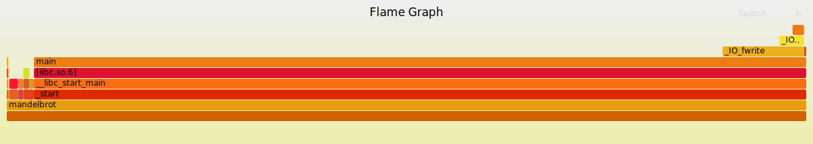

# Profiling de programmes
Le choix des deux programmes à profiler s'est porté sur le *Mandelbrot set* non interactif et la *Fast Fourier Transform (FFT)*. La compression *LZW* ne compilait pas et à donc été laissée de côté.

## Présentation des programmes
### Mandelbrot set
Le *Mandelbrot set* est un ensemble de nombres complexes pour lesquels la suite de nombres complexes définie par la relation de récurrence suivante est bornée:
$$
z_{n+1} = z_n^2 + c
$$
avec $z_0 = 0$ et $c$ un nombre complexe quelconque. Le *Mandelbrot set* est l'ensemble des nombres complexes $c$ pour lesquels la suite est bornée.

Le programme génère une image du *Mandelbrot set* en calculant pour chaque pixel de l'image si le nombre complexe correspondant est dans l'ensemble ou non. Le programme est non interactif et ne prend pas d'arguments.

### Fast Fourier Transform
La *Fast Fourier Transform* est un algorithme permettant de calculer la *Discrete Fourier Transform* (DFT) d'un signal. La DFT d'un signal $x$ est définie par:
$$
X_k = \sum_{n=0}^{N-1} x_n e^{-i 2 \pi k n / N}
$$
avec $N$ la longueur du signal et $k$ un entier compris entre $0$ et $N-1$. La FFT est un algorithme permettant de calculer la DFT en $O(N \log N)$ au lieu de $O(N^2)$ pour l'algorithme naïf.

Le programme est non interactif et ne prend pas d'arguments. Il va prendre un tableau de 8 nombres complexes et calculer la FFT de ce tableau.

## Profiling avec `perf` et `flamegraph`
### Situation initiale
La première étape a été de profiler le code tel quel avec `perf` et de générer un *flamegraph* pour avoir une idée des parties du code qui prennent le plus de temps. Les résultats sont présentés ci-dessous.




On remarque qu'il n'y a pas vraiment d'informations pertinentes vu que le code s'exécute en très peu de temps et ne passe pas beaucoup de temps dans la fonction main. Une solution est d'essayer de fournir plus de travail au code en lui demandant de traiter des images plus grandes ou des tableaux plus longs.

### Augmentation de la taille des données
Pour le *Mandelbrot set*, on a augmenté la taille de l'image de 800x800 à 8000x8000. Pour la FFT, on a augmenté la taille du tableau de 8 à $2^{18}$ (262'144). Les résultats sont présentés ci-dessous.


On remarque que l'outil `flamegraph` ne permet pas de donner une image très précise dans notre cas, en effet la fonction `fft` s'exécute de manière récursive, ce qui n'est pas visible ici.

## Visualisation avec `Hotspot`
On peut utiliser l'outil `Hotspot` pour avoir une visualisation plus précise de l'exécution du programme. Les données avaient déjà été sorties par `perf` dans un fichier `perf.data` et il suffit de charger ce fichier dans `Hotspot` pour avoir une visualisation de l’exécution du programme.

### Mandelbrot set
En utilisant `Hotspot` on obtient une vision plus précise de l'exécution de ce programme. On peut également regarder le code source et voir les lignes de code qui prennent le plus de temps. Les résultats sont présentés ci-dessous (`Hotspot` a commencé a générer des artifacts sur les *flamegraph* à partir de ce moment sans raison précise).

![Mandelbrot set (8000x8000) [13.6s]](img/hotspot-mandelbrot.png)


\clearpage

On voit clairement que les opérations les plus intensives sont la multiplication et l'addition de nombres complexes, ainsi que la boucle qui teste la convergence de la suite de nombres complexes. Le compilateur a également généré des instructions `SIMD` pour les opérations sur les nombres complexes.

Si on décide de compiler le programme avec les options `-O3` et `-march=native` pour optimiser le code, on obtient les résultats suivants:

![Mandelbrot set (8000x8000) [9s]](img/mandelbrot-opt-usage.png)

On a une amélioration du temps de performance et on peut voir d'autres instructions `SIMD` qui ont été générées comme `vmulsd` et `vaddsd` pour les multiplications et additions.

### FFT
En chargeant le fichier `perf.data` dans `Hotspot` on obtient une visualisation de l'exécution du programme. Les résultats sont présentés ci-dessous.

![FFT (262'144) [0.15s]](img/hotspot-fft-stacked.png)

\clearpage

## Toolkit `valgrind`
En utilisant la suite d'outils `valgrind`, notamment l'outil `callgrind` on peut mesurer et instrumenter l'exécution des programmes dans un environnement contrôlé. Le désavantage est que les performances vont être moins bonnes, mais on peut avoir une idée plus précise de l'exécution du programme.

### Mandelbrot set
En utilisant `callgrind` avec l'option `--simulate-cache=yes` on obtient les résultats suivants:

```txt
==8432== Events    : Ir Dr Dw I1mr D1mr D1mw ILmr DLmr DLmw
==8432== Collected : 27360536771 2434436257 1601485729 1406 1359 706 1381 1023 676
==8432==
==8432== I   refs:      27,360,536,771
==8432== I1  misses:             1,406
==8432== LLi misses:             1,381
==8432== I1  miss rate:           0.00%
==8432== LLi miss rate:           0.00%
==8432==
==8432== D   refs:       4,035,921,986  (2,434,436,257 rd + 1,601,485,729 wr)
==8432== D1  misses:             2,065  (        1,359 rd +           706 wr)
==8432== LLd misses:             1,699  (        1,023 rd +           676 wr)
==8432== D1  miss rate:            0.0% (          0.0%   +           0.0%  )
==8432== LLd miss rate:            0.0% (          0.0%   +           0.0%  )
==8432==
==8432== LL refs:                3,471  (        2,765 rd +           706 wr)
==8432== LL misses:              3,080  (        2,404 rd +           676 wr)
==8432== LL miss rate:             0.0% (          0.0%   +           0.0%  )
```

Avec les différents évènements qui ont été collectés et les données de cache. On peut déjà voir que il n'y a pas beaucoup de *cache misses* dans ce programme. On a également la possibilité de visualiser le rapport qui a été fait par `callgrind`, par exemple avec l'outil `qcachegrind`:


\clearpage

On voit ici que les `Data Write Misses` sont le plus souvent dans les fonctions de lecture ou écriture dans les fichiers. Dans l'image suivante on voit que ce sont également les instructions qui s'executent le plus souvent, surtout `fwrite`. On voit également que les multiplications et la boucle génèrent beaucoup d'instructions.


### FFT
En utilisant `callgrind` avec l'option `--simulate-cache=yes` on obtient les résultats suivants:

```txt
==13575== Events    : Ir Dr Dw I1mr D1mr D1mw ILmr DLmr DLmw
==13575== Collected : 753002978 198134782 70505040 1506 3966469 4035295 1491 797843 877114
==13575==
==13575== I   refs:      753,002,978
==13575== I1  misses:          1,506
==13575== LLi misses:          1,491
==13575== I1  miss rate:        0.00%
==13575== LLi miss rate:        0.00%
==13575==
==13575== D   refs:      268,639,822  (198,134,782 rd + 70,505,040 wr)
==13575== D1  misses:      8,001,764  (  3,966,469 rd +  4,035,295 wr)
==13575== LLd misses:      1,674,957  (    797,843 rd +    877,114 wr)
==13575== D1  miss rate:         3.0% (        2.0%   +        5.7%  )
==13575== LLd miss rate:         0.6% (        0.4%   +        1.2%  )
==13575==
==13575== LL refs:         8,003,270  (  3,967,975 rd +  4,035,295 wr)
==13575== LL misses:       1,676,448  (    799,334 rd +    877,114 wr)
==13575== LL miss rate:          0.2% (        0.1%   +        1.2%  )
```

On voit ici qu'il y a plus de *cache misses* que le programme précédent. On peut également visualiser le rapport qui a été fait par `callgrind` :


On peut voir que la majorité des instructions proviennent du calcul de l'exponentielle. C'est donc un point intéressant à considérer pour optimiser le programme. Dans le rapport suivant on voit que les `Data Misses` sont très nombreuses. Ceci peut s'expliquer par la manière dont l'algorithme fonctionne, à aller chercher la moitié du tableau à chaque itération. On pourrait envisager une structure de données différente pour optimiser ce point.


### `memcheck`
On peut également utiliser l'outil `memcheck` pour visualiser les potentielles fuites de mémoire. On obtient, par exemple pour `mandelbrot` les résultats suivants:

```txt
==21483== Command: ./mandelbrot
==21483==
==21483==
==21483== HEAP SUMMARY:
==21483==     in use at exit: 0 bytes in 0 blocks
==21483==   total heap usage: 2 allocs, 2 frees, 4,568 bytes allocated
==21483==
==21483== All heap blocks were freed -- no leaks are possible
==21483==
==21483== ERROR SUMMARY: 0 errors from 0 contexts (suppressed: 0 from 0)
```

\pagebreak
# Profiling `A*`
## Baseline
### *tab*
En revenant en arrière dans les versions du code, on peut observer les changements et les optimisations qui ont été faites. La première version du code n'était vraiment pas optimisée et le temps d'exécution était très long. En profilant l’exécutable on peut voir que la majorité du temps est passé dans la fonction `is_in_list()`.


Le code qui cause ces ralentissements est le suivant :

```c
Node *is_in_list(Node **list, int list_size, int x, int y)
{
    for (int i = 0; i < list_size; i++)
    {
        if (list[i]->pos.x == x && list[i]->pos.y == y)
        {
            return list[i];
        }
    }
    return 0;
}
```

On peut voir que la fonction parcours toute la liste passée en paramètre à chaque fois qu'elle est appelée. Et cette fonction est appelée ~12 milliards de fois. C'est donc clairement un point à optimiser. Voici ce que `callgrind` nous montre :


\clearpage

Cette fonction provoque également énormément de *branch misses* à cause de la condition à l'intérieur de la boucle :


### *struct*
Pour ce qui est de l'algorithme utilisant les structures, la fonction `check_neighbour()` est celle qui prend le plus de temps. Cette fonction souffre du même problème que la fonction `is_in_list()`. Elle parcours toute la liste des noeuds à chaque fois qu'elle est appelée. 


Cette fonction présente également le désavantage de parcourir une liste chaînée, ce qui n'est pas optimal pour l'accès mémoire. On peut le voir dans le rapport suivant :


Cette fonction devra également être améliorée et optimisée pour améliorer les performances de l'algorithme.

\pagebreak
## Première optimisation
Pour enlever le parcours de la liste à chaque fois, on a opté pour un ajout d'un tableau *bitmap* qui stocke si un noeud a déjà été visité ou non. Les changements apportés sont les suivants, dans la fonction `compute_path_tab()` :

```c
    char **open_list_map = calloc(grid->rows, sizeof(char *));
    char **closed_list_map = calloc(grid->rows, sizeof(char *));

    int **h_costs = malloc(grid->rows * sizeof(int *));

    for (int i = 0; i < grid->rows; i++)
    {
        open_list_map[i] = calloc(grid->cols, sizeof(char));
        closed_list_map[i] = calloc(grid->cols, sizeof(char));

        h_costs[i] = malloc(grid->cols * sizeof(int));
        for (int j = 0; j < grid->cols; j++)
        {
            h_costs[i][j] = abs(grid->dst->x - i) + abs(grid->dst->y - j);
        }
    }
```

On peut voir l'initialisation des deux *bitmap* pour les `closed_list` et `open_list`. On peut également voir l'initialisation du tableau des `h_costs` qui est utilisé pour pré-calculer le coût de chaque noeud. Cette optimisation a permis de réduire le temps passé à parcourir les deux listes de noeuds. On peut voir l'amélioration dans les graphiques suivants :


Le prochain *bottleneck* semble être dans la fonction `compute_path_tab()`. Après analyse grâce à `perf` et `callgrind` nous pouvons voir que la recherche du noeud avec le plus petit coût est le point qui prend le plus de temps. On peut voir dans les screenshots suivants.


\pagebreak
## Deuxième optimisation
Pour cette deuxième optimisation, nous avons décidé de changer la structure de données utilisée pour stocker les noeuds. Nous avons opté pour une structure de données de type *heap* qui permet de stocker les noeuds de manière à ce que le noeud avec le plus petit coût soit toujours en tête de liste. Cela permet de réduire le temps passé à chercher le noeud avec le plus petit coût. Voici les changements apportés dans la fonction `compute_path_tab()` :

```c
    MinHeap *open_set = heap_create(grid->rows * grid->cols);
    Position **parent_set = malloc(grid->rows * sizeof(Position *));

    /* ... */

    heap_insert(open_set, start);

    /* ... */

    while (open_set->size > 0)
    {
        MinHeapNode current = heap_pop(open_set);
        open_map[current.x][current.y] = false;

        /* ... */
    }
```

La `MinHeap` s'occupe de s'équilibrer toute seule et de garder le noeud avec le plus petit coût en tête de liste. Ceci permet de drastiquement réduire les instructions exécutées dans la fonction `compute_path_tab()`. Les options d'optimisation ont du être enlevées car la fonction était *inlinée* par le compilateur et il était difficile de parcourir le code avec `perf` et `callgrind`. On peut voir les résultats de cette optimisation dans les graphiques suivants :


\clearpage

On voit clairement que la fonction `compute_path_tab()` n'est plus la fonction critique en termes de cycles d'instructions. C'est maintenant la fonction `init_grid_tab()`. Les opérations de la *heap* prennent également quelques cycles, mais ce n'est rien comparé à la réduction de cycles dans la fonction `compute_path_tab()`.

### *struct*
L'optimisation de la *heap* concernait aussi l'algorithme utilisant les structures. On peut voir les résultats de cette optimisation dans les graphiques suivants :


Là aussi l'amélioration est visible, et c'est la fonction `check_neighbours_struct()` qui prend le plus d'instructions et cause le plus de *branch-misses*. Ceci est surtout du au fait que les voisins doivent être chargés et qu'on doive contrôlé leur valeur pour savoir si on est hors de la grille ou pas. On peut le voir dans le rapport de `perf`. Il faut tenir compte du fait que cette fonction a été mise *inline* par le compilateur, ce qui veut dire que ce n'est qu'un appel de la fonction qui est visualisé dans le rapport. Il en existe donc plusieurs, mais le rapport ne montre que le premier appel.


\pagebreak

## Futures optimisations
Comme vu dans les analyses précédentes, l'algorithme de recherche de chemin est maintenant plus optimisé. La partie plus gourmande et qui cause plus de *misses* est maintenant la génération de la grille. Bien qu'elle ne fasse pas directement partie de l'algorithme ces fonctions pourraient être optimisées un peu. Une première piste serait de lire le fichier de labyrinthe ligne par ligne et pas caractère par caractère.


\clearpage

Une autre optimisation qui pourrait encore réduire le nombre de cycles et optimiser l'utilisation des registres est l'implémentation de fonctions *SIMD* dans les opérations sur les tableaux. Par exemple, le calcul des `h_costs` pourrait être fait en parallèle sur plusieurs valeurs. Cela permettrait de réduire le nombre d'instructions et de réduire le nombre de *cache misses*. Voici l'implémentation de ce code :

```c
    /* Fonction compute_path_tab */

    __m128i dy_vec = _mm_set_epi32(3, 2, 1, 0);
    __m128i mul_factor = _mm_set1_epi32(10);

    for (int i = 0; i < rows; i++)
    {
        int dx = (i - end_x) * (i - end_x);

        __m128i dx_vec = _mm_set1_epi32(dx);
        __m128i dy_val;
        for (int j = 0; j < cols - 3; j += 4)
        {
            dy_val = _mm_add_epi32(dy_vec, _mm_set1_epi32(j - end_y));
            dy_val = _mm_mullo_epi32(dy_val, dy_val);
            dy_val = _mm_add_epi32(dx_vec, dy_val);
            dy_val = _mm_mullo_epi32(dy_val, mul_factor);
            _mm_store_si128((__m128i *)&h_costs[i][j], dy_val);
        }
        /* Si cols n'est pas un multiple de 4 */
        for (int j = cols & ~3; j < cols; j++)
        {
            int dy = j - end_y;
            h_costs[i][j] = (dx + dy * dy) * 10;
        }
    }
```

Grâce à cette optimisation on arrive à réduire le nombre de cycles d'instructions de la fonction `compute_path_tab()` de 2%. On peut voir les résultats de cette optimisation dans les graphiques suivants :


La fonction `check_neigbour_*`(tab et struct) génèrent pas mal de *cache* et *branch misses*. Une amélioration possible serait de regrouper ces appels en une fonction qui irait vérifier les 4/8 voisins en même temps. Ceci optimiserait la relation spatiale des données et permettrait de réduire le nombre de *cache misses*. Pour les *branch misses* il faudrait réfléchir à comment réordonner les instructions pour éviter les branches le plus possible.

# Conclusion
On voit grâce au profiling l'évolution de l'algorithme et comment pouvoir identifier les *bottlenecks* et les optimiser. On voit aussi que les optimisations ne sont pas toujours évidentes et qu'il faut parfois réfléchir à comment réorganiser le code pour pouvoir optimiser les *cache misses* et les *branch misses*. L'utilisation d'instructions *SIMD* permet aussi de réduire le nombre d'instructions et d'optimiser l'utilisation des données. Un travail futur consistera à explorer les possibilités de parallélisation de l'algorithme. En effet plusieurs parties de l'algorithme sont indépendantes et pourraient être exécutées en parallèle. Cela permettrait de réduire le temps d'exécution de l'algorithme.