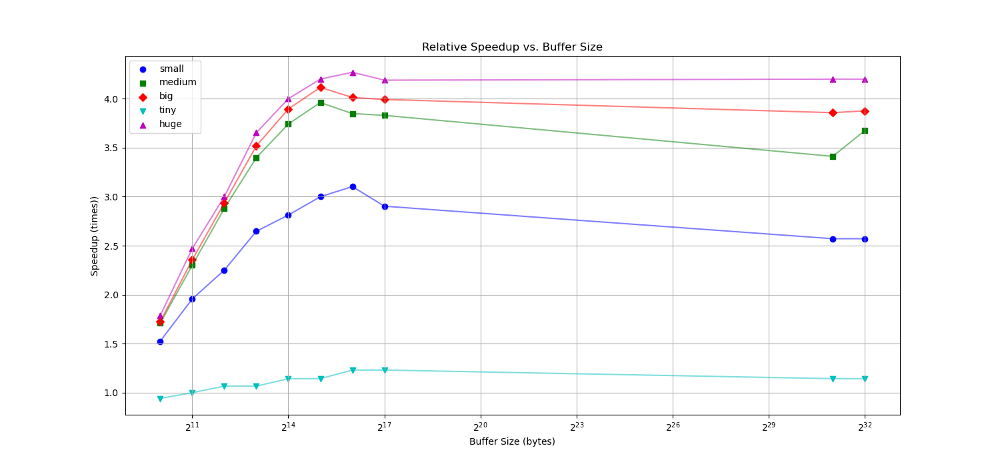

---
title: "Laboratoire 6: Parallélisme des tâches"
subtitle: "HPC 2023"
date: 2.06.23
author: "Francesco Monti"
toc: false
...

# Partie 1: Statistique de fichier parallélisée
Pour cette partie, nous avons du implémenter une version parallélisée du décompte de caractères dans des fichiers texte. Pour ce faire, j'ai utilisé *OpenMP* et un système de buffer. Voici les détails de l'implémentation.

## Implémentation
### Makefile
Afin de tirer parti de la parallélisation, j'ai utilisé le flag `-fopenmp` dans le Makefile. J'ai également ajouté un flag `-O3` pour optimiser le code.

### Fonction `count_occurrences`
Cette fonction, en plus de prendre le fichier et le tableau de occurrences, va aussi prendre une taille de buffer, ce qui va nous permettre de tester les différentes tailles. Premièrement, on va créer un buffer de la taille donnée et récupérer la taille de fichier avec `fseek`.

```c
char *buffer = malloc(buffer_size * sizeof(char));
// Determine the file size
fseek(file, 0, SEEK_END);
size_t fileSize = ftell(file);
fseek(file, 0, SEEK_SET);
```

On va ensuite calculer les tailles des chunks à lire dans le fichier afin de bien calibrer les threads. On va lire le premier chunk et stocker le nombre de bytes lu dans une variable. On va aussi déclarer un tableau local à chaque thread, qui va contenir les occurrences de chaque caractère afin de ne pas interrompre les threads trop souvent.

```c
size_t remainingBytes = fileSize;
size_t chunkBytes = (remainingBytes < buffer_size) ? remainingBytes : buffer_size;
size_t bytesRead;
int l_occurrences[MAX_CHARACTERS * 2] = {0};
while (remainingBytes > 0 && (bytesRead = fread(buffer, sizeof(char), chunkBytes, file)) > 0)
    {
        // Count
    }
```

A ce moment là vient la partie parallèle du programme. Comme les lectures sont critiques, seul un thread à la fois peut lire dans le fichier. Cependant, le comptage des occurrences peut être fait en parallèle. Pour ce faire la directive d'`OMP` suivante est utilisée :

```c
#pragma omp parallel shared(buffer, bytesRead) firstprivate(l_occurrences) reduction(+ : occurrences[ : MAX_CHARACTERS * 2])
```

On va définir une section parallèle, avec deux variables partagées : le buffer et le nombre de bytes lus. On va également définir une réduction sur le tableau d'occurrences, afin de pouvoir additionner les résultats de chaque thread. On déclare le tableau défini précédemment comme `firstprivate`. Ce tableau va être ajouté au nombre total d'occurrences une fois le chunk traité. La prochaine étape consiste à parcourir le buffer et incrémenter les occurrences de chaque caractère rencontré. Cette opération peut être faite encore une fois en parallèle, et cette fois-ci, une boucle `for` avec la directive `#pragma omp for` est utilisée. Chaque thread va se voir attribuer une partie du buffer à traiter, et va incrémenter les occurrences de chaque caractère rencontré. Cette partie est la même que dans l'algorithme non-parallèle.

Une fois le chunk traité, on va ajouter les occurrences du tableau local au tableau global, et on va lire le prochain chunk. Si le nombre de bytes lus est inférieur à la taille du buffer, on va lire le reste du fichier. Une fois le fichier lu, on va libérer le buffer et fermer le fichier.

## Résultats
### Fichiers de test
Pour tester le programme, j'ai utilisé les fichiers de test suivants :

| Fichier   | Lignes      | Colonnes  | Taille  | Temps   |
|-----------|-------------|-----------|---------|---------|
|  `tiny`   |     100     |    1000   |  10 KB  |  1.6 ms |
|  `small`  |     1000    |    1000   |  1 MB   |  9 ms   |
|  `medium` |     1000    |    10000  |  10 MB  | 81.2 ms |
|  `big`    |     10000   |    10000  |  100 MB | 798.5 ms|
|  `huge`   |     10000   |    100000 |  1 GB   |  8.4 s  |

### Résultats
Voici les résultats obtenus avec différentes tailles de buffer et fichers. Les deux dernières valeurs testées pour la taille du buffer correspondent à `INT_MAX` et `UINT_MAX`.

#### Fichier `tiny`

| Fichier   | Buffer      | Temps   |
|-----------|-------------|---------|
|  `tiny`   |     1024    |  1.7 ms |
|  `tiny`   |     2048    |  1.6 ms |
|  `tiny`   |     4096    |  1.5 ms |
|  `tiny`   |     8192    |  1.5 ms |
|  `tiny`   |     16384   |  1.4 ms |
|  `tiny`   |     32768   |  1.4 ms |
|  `tiny`   |     65536   |  1.3 ms |
| `tiny`    |     131072   |  1.3 ms |
|  `tiny`   |     2147483647   |  1.4 ms |
|  `tiny`   |     4294967295   |  1.4 ms |         

#### Fichier `small`

| Fichier   | Buffer      | Temps   |
|-----------|-------------|---------|
|  `small`  |     1024    |  5.9 ms|         
|  `small`  |     2048    |  4.6 ms|         
|  `small`  |     4096    |  4 ms  |         
|  `small`  |     8192    |  3.4 ms  |         
|  `small`  |     16384   |  3.2 ms |         
|  `small`  |     32768   |  3 ms  |
|  `small`  |     65536   |  2.9 ms  |
|  `small`  |     131072   |  3.1 ms  |
|  `small`  |     2147483647   |  3.5 ms  |       
|  `small`  |     4294967295   |  3.5 ms |   

\clearpage
#### Fichier `medium`

| Fichier   | Buffer      | Temps   |
|-----------|-------------|---------|
|  `medium` |     1024    |  47.5 ms|
|  `medium` |     2048    |  35.3 ms|
|  `medium` |     4096    |  28.2 ms|
|  `medium` |     8192    |  23.9 ms|
|  `medium` |     16384   |  21.7 ms|         
|  `medium` |     32768   |  20.5 ms|
|  `medium` |     65536   |  21.1 ms|
|  `medium` |     131072   |  21.2 ms|
|  `medium` |     2147483647   |  23.8 ms|      
|  `medium` |     4294967295   |  22.1 ms|     

#### Fichier `big`

| Fichier   | Buffer      | Temps   |
|-----------|-------------|---------|
|  `big`    |     1024    |  463 ms|
|  `big`    |     2048    |  339 ms|
|  `big`    |     4096    |  272 ms|
|  `big`    |     8192    |  227 ms|
|  `big`    |     16384   |  205 ms|         
|  `big`    |     32768   |  194 ms|
|  `big`    |     65536   |  199 ms|
|  `big`    |     131072   |  200 ms|
|  `big`    |     2147483647   |  207 ms|
|  `big`    |     4294967295   |  206 ms|

#### Fichier `huge`

| Fichier   | Buffer      | Temps   |
|-----------|-------------|---------|
|  `huge`   |     1024    |  4.7 s|
|  `huge`   |     2048    |  3.4 s|
|  `huge`   |     4096    |  2.8 s|
|  `huge`   |     8192    |  2.3 s|
|  `huge`   |     16384   |  2.1 s|         
|  `huge`   |     32768   |  2 s|
|  `huge`   |     65536   |  1.9 s|
|  `huge`   |     131072   |  2 s|
|  `huge`   |     2147483647   |  2 s|       
|  `huge`   |     4294967295   |  2 s|

On peut voir sur le graphique suivant les améliorations de performance en fonction de la taille du buffer. On peut voir que les performances s'améliorent progressivement que la taille augmente, mais un buffer trop grand n'apporte rien de plus. La limite semble être autour de 65536 bytes (64 KB). On va donc fixer la taille du buffer à 65536 bytes. On remarque également que les performances sont meilleures avec des fichiers plus gros. Pour des petits fichiers comme `tiny.txt` la marge n'est pas beaucoup plus grande que 1x et ne monte pas plus que 1.3x environ. Mais pour de grands fichier comme `huge.txt` celle-ci monte jusqu'à 4.3x environ. Ceci est sûrement du à l'overhead de lire le ficher par bout et dispatcher sur plusieurs threads, qui est plus important pour les petits fichiers.



\pagebreak
# Partie 2 : Parallélisation de A* avec OpenMP
## Première approche
Afin de paralléliser A*, la première approche a été de chercher dans le code des parties pouvant être exécutées en parallèle. Certaines boucles, comme l'initialisation des coûts (`h_costs`) peuvent être parallélisables. On utilise la clause `reduction` qui permet de faire une opération sur une variable partagée et de stocker le résultat dans une variable privée. On peut donc paralléliser la boucle avec les directives suivantes :

```c
#pragma omp parallel for shared(dx, cols) reduction(+ : h_costs[i][ : cols])
```

et 

```c
#pragma omp parallel for shared(h_costs, i, dx_vec, dy_vec, mul_factor, end_y, cols)
```

Une autre partie parallélisable est la fonction qui va libérer la mémoire, cette fonction execute plusieurs tâches indépendantes et peut donc être subdivisée en sections. On utilise la directive `#pragma omp parallel sections` et `#pragma omp section`.

## Parallélisation de la recherche de voisins
Une partie du code qui pourrait être parallélisée serait la partie qui va contrôler les voisins du noeud courant. Cette recherche n'est pas complètement indépendante car elle va modifier plusieurs variables partagées. Mais la plupart de ces variables ne sont pas accédées en écriture au même endroit, on a donc pas de risque de datarace sur ces variables. Le problème principal découle du fait que la structure utilisée pour stocker les noeuds ouverts est une `Min Heap`, ce qui rend difficile la parallélisation de la recherche de voisins. En effet, la recherche de voisins va modifier la structure de données, et donc la rendre invalide pour les autres threads. On pourrait donc utiliser une structure de données qui permet de faire des opérations en parallèle, ce qui implique de réécrire une partie du code.

### Circular buffer
Un tas est une structure déjà très optimale en termes d'accès en lecture et écriture, et a de très bonnes performances dans notre cas. Pour essayer de ne pas perdre trop de performances sur une structure alternative, nous pouvons nous pencher sur un `circular buffer`. En effet, les besoins pour cette structures sont un accès à la plus petite valeur (index 0 ou premier noeud), une possibilité de paralléliser l'insertion sans invalider complètement la structure ou devoir trier sur le moment et un algorithme de tri qui est efficace sur des données presque triées. En ce qui concerne l'algorithme nous pouvons utiliser un `insertion sort`. Et pour la structure de données, un buffer circulaire nous permet d'ajouter en $\mathcal{O}(1)$ et de lire en $\mathcal{O}(1)$, ce qui est très similaire à un tas. La suppression est en $\mathcal{O}(n)$ mais la suppression du premier élément est en $\mathcal{O}(1)$. Comme nous n'effectuons que des suppressions en début de liste, nous ne perdons pas de performances à l'insertion et suppression. Par contre la liste doit être triée et la complexité d'un `insertion sort` est $\mathcal{O}(n^2)$, mais dans notre cas la liste est presque triée, donc la complexité est $\mathcal{O}(n)$.

Le code doit être adapté pour utiliser un buffer circulaire et son implémentation se trouve dans les fichiers `circ_buffer.h` et `circ_buffer.c`. La structure d'un élément de buffer, `cb_node_t` et équivalente à celle de la `MinHeap` précédente. Ceci nous permet de garder une bonne partie du code intacte et ne pas trop modifier les interactions et la logique. Le buffer possède des méthodes permettant la création, l'insertion et la récupération d'un élément, le tout étant optimisé pour notre cas courant. Il y a donc une méthode permettant de "pop" un élément, c'est-à-dire récupérer le premier élément de la liste et le supprimer de celle-ci. Le tri du tableau est effectué par la méthode `insertion_sort_circular_buffer` qui prend en paramètre le buffer à trier. Séparer l'insertion et le tri du tableau nous permet d'insérer plusieurs élément avant de faire un tri sur tous et donc gagner un peu de temps. Ceci va être utilisé lors de la parallélisation de la recherche de voisins.

### Parallélisation
Comme dit auparavant, nous pouvons paralléliser la recherche de voisins grâce à notre buffer circulaire. Pour ce faire, nous allons définir une section parallèle au moment d'exécuter les fonctions `check_neighbour_tab` et `check_neighbour_struct` grâce aux directives suivantes :

```c
// Pour tab
#pragma omp parallel for shared(open_set, open_map, closed_map, h_costs, parent_set, current, rows, cols)
for (int i = -1; i <= 1; i++){ /* ... */ }
``` 

```c
// Pour struct
#pragma omp parallel sections shared(current, open_set, open_map, closed_map, h_costs, parent_set, current_node)
{
    #pragma omp section // 4 fois
    {
        /* ... */
    }
}
```

La version pour le tableau fonctionne avec un dispatch de boucle for, qui s'exécute trois fois. La version pour struct fonctionne un peu différemment vu qu'il n'y a pas une boucle mais simplement quatre appels à la fonction avec les quatres voisins passés en paramètre. On va donc utilisé des `sections` pour exécuter les quatres appels en parallèle. Dans ces deux fonctions il y a une section critique au moment d'insérer un nouveau élément à la liste, ceci est nécessaire pour éviter les dataraces. La section critique est définie de la manière suivante :

```c
#pragma omp critical
circular_buffer_insert(open_set, neighbour_node);
```

Après avoir contrôlé les différents voisins et avant de recommencer la boucle, on va trier le buffer circulaire. Ceci est fait pour éviter de faire un tri à chaque insertion, ce qui serait très coûteux. Le tri est précédé par une directive `#pragma omp single` qui permet de s'assurer que le tri ne sera effectué qu'une seule fois. La fonction `insertion_sort_circular_buffer` est appelée dans cette section.

## Résultats
On peut voir les résultats suivants avec la fonction `compute_path_tab` :

| Command | Mean [ms] | Min [ms] | Max [ms] | Relative |
|:---|---:|---:|---:|---:|
| `./a_star tab 100 100 ../files/input100` | 1.3 ± 0.1 | 1.1 | 2.4 | 1.00 |
| `./a_star-omp tab 100 100 ../files/input100` | 2.9 ± 0.5 | 2.6 | 13.3 | 2.28 ± 0.44 |
| `./a_star tab 200 200 ../files/input200` | 3.0 ± 0.2 | 2.8 | 4.3 | 2.39 ± 0.28 |
| `./a_star-omp tab 200 200 ../files/input200` | 8.3 ± 0.5 | 7.7 | 12.8 | 6.54 ± 0.74 |
| `./a_star tab 250 250 ../files/input250` | 4.3 ± 0.3 | 4.0 | 6.0 | 3.41 ± 0.39 |
| `./a_star-omp tab 250 250 ../files/input250` | 12.0 ± 0.7 | 11.3 | 19.1 | 9.42 ± 1.08 |
| `./a_star tab 300 300 ../files/input300` | 5.8 ± 0.3 | 5.5 | 9.4 | 4.60 ± 0.51 |
| `./a_star-omp tab 300 300 ../files/input300` | 18.8 ± 22.2 | 15.9 | 297.0 | 14.79 ± 17.53 |
| `./a_star tab 500 500 ../files/input500` | 14.8 ± 0.5 | 14.1 | 17.8 | 11.63 ± 1.19 |
| `./a_star-omp tab 500 500 ../files/input500` | 46.4 ± 1.2 | 45.0 | 50.1 | 36.56 ± 3.65 |
| `./a_star tab 1000 1000 ../files/input1000` | 55.1 ± 1.6 | 53.6 | 64.8 | 43.36 ± 4.37 |
| `./a_star-omp tab 1000 1000 ../files/input1000` | 177.9 ± 4.5 | 173.9 | 192.9 | 140.10 ± 14.00 |
| `./a_star tab 2000 2000 ../files/input2000` | 209.6 ± 7.0 | 205.6 | 233.4 | 164.99 ± 16.88 |
| `./a_star-omp tab 2000 2000 ../files/input2000` | 671.4 ± 4.9 | 666.5 | 683.4 | 528.66 ± 51.28 |
| `./a_star tab 2500 2500 ../files/input2500` | 324.8 ± 6.4 | 319.7 | 338.7 | 255.76 ± 25.25 |
| `./a_star-omp tab 2500 2500 ../files/input2500` | 971.8 ± 6.9 | 965.5 | 987.7 | 765.17 ± 74.22 |
| `./a_star tab 5000 5000 ../files/input5000` | 1269.9 ± 33.8 | 1239.3 | 1341.4 | 999.84 ± 100.31 |
| `./a_star-omp tab 5000 5000 ../files/input5000` | 3712.5 ± 112.4 | 3652.0 | 4026.3 | 2923.07 ± 296.29 |

On peut voir par ce tableau que les performances de la version parallèle sont malheureusement moins bonnes que la version séquentielle. Ceci est peut-être dû au fait que l'overhead de la création et la synchonisation des threads est plus grand que le gain apporté par la parallélisation. Une autre possibilité est que l'utilisation d'un buffer circulaire au lieu d'un tas ralenti considérablement les performances. Malgré ces résultats, l'utilisation des ressources de la machine est mieux répartie et ceci forme une base sur laquelle optimiser ultérieurement le code. Par exemple la fonction d'initialisation pourrait être encore améliorée et parallélisée pour gagner du temps.

Ce labo m'a permis de mieux comprendre et expérimenter avec différentes techniques de parallélisation et avec *OpenMP*. Ce sont des connaissances qui me seront clairement utiles dans le futur. J'ai aussi pu voir que la parallélisation n'est pas toujours la solution à tous les problèmes et qu'il faut bien analyser le problème avant de se lancer là-dedans.